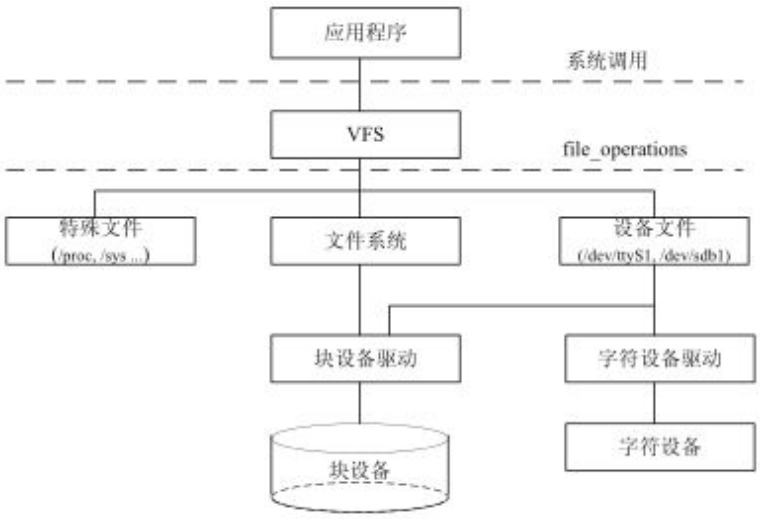
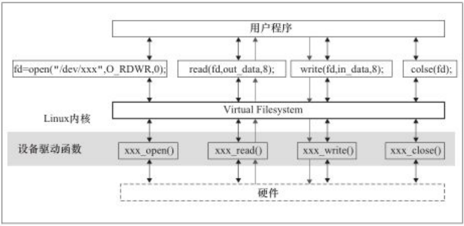
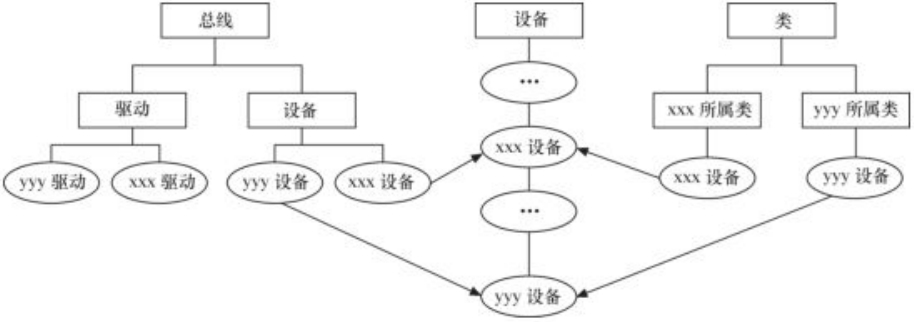

# 设备模型与平台设备驱动

字符设备最终对应用程序来说就是个文件。体现了 linux 中 “everything is a file” 的设计思想。

用户应用最终使用文件操作相关的系统调用(或C库函数)来访问硬件，因此驱动开发者也有必要学习linux 文件系统、设备文件系统和设备模型。

## linux 文件系统相关

参考资料 linux 系统编程、操作系统文件系统相关内容

### 文件系统 api


### 文件系统与设备驱动

<figure>
  
  <figcaption>文件系统与设备驱动之间的关系</figcaption>
</figure>

linux 中虚拟文件系统、磁盘文件系统、设备文件、设备驱动的关系。

应用程序和 VFS 之间的接口是系统调用，VFS 与文件系统、设备文件、其他特殊文件的接口是 `file_operations` 结构体的成员函数，这个结构体包含对文件的 open close read write 方法。

字符设备的上层没有类似块设备上面的 ext4 文件系统，所以字符设备的 `file_operations` 成员函数直接由设备驱动程序提供。块设备有两种访问方法，一种是不通过文件系统直接访问裸设备，另一种是通过文件系统来访问，文件操作结构体实现在文件系统内，文件系统会把对文件的读写转换为对扇区的读写，在设备驱动层看不到 `file_operations` 的存在。


<figure>
  
  <figcaption>应用程序、VFS与设备驱动</figcaption>
</figure>


### sysfs 文件系统

2.6 之后的内核引入了 sysfs 文件系统，他和 proc 的类型一样是虚拟文件系统，包括所有系统硬件的层级视图。

sysfs 把连接在系统上的设备和总线组成成一个分级的文件，向用户空间导出内核数据结构和属性。sysfs 的一个目的就是暂时设备驱动模型中各组件的层次关系。

```bash
ls /sys
# block  bus  class  dev  devices  firmware  fs  hypervisor  kernel  module  power
```

- block 所有块设备
- bus 系统中的总线类型
- class 系统中的设备类型
- devices 系统所有的设备，根据设备挂接总线类型组成


## linux 设备模型简介

前面的驱动中，linux 驱动的大致内容：

- 实现入口函数 `xxx_init()` 和卸载函数 `xxx_exit()`
  - 申请设备号 register_chrdev_region()
  - 初始化字符设备，cdev_init函数、cdev_add函数
  - 硬件初始化，如时钟寄存器配置使能，GPIO设置为输入输出模式等。
- 构建file_operation结构体内容，实现硬件各个相关的操作
- 终端上使用mknod根据设备号来进行创建设备文件(节点) (也可以在驱动使用class_create创建设备类、在类的下面device_create创建设备节点)

kernel 源码中，/driver 文件夹下都是设备驱动代码，可以参考这里的实现。

前面的 LED 驱动代码，有个问题，硬件信息全部被硬编码进代码中，这种方式本质上和 STM32 还是没啥区别，只不过基于 linux 的接口、用 linux 的要求实现的。


linux 引入了设备驱动模型分层的概念，将驱动代码分成了两块：**设备**与**驱动**。设备负责提供硬件资源，驱动去使用这些资源。**总线**将它们联系起来。这样子就构成以下图形中的关系。

- 设备(device) ：挂载在某个总线的物理设备(虚拟对象也行)；
- 驱动(driver) ：与特定设备相关的软件(代码实体)，负责初始化该设备以及提供一些操作该设备的操作方式；
- 总线（bus) ：负责管理挂载对应总线的设备以及驱动；

可以看出，这里的总线比实际的总线概念更大，这里的总线还包含了代码上的东西。

<figure>
  
  <figcaption>linux 下的设备</figcaption>
</figure>

<figure>
  
</figure>

在根文件系统中有个`/sys`文件目录，里面记录各个设备之间的关系。下面介绍/sys下几个较为重要目录的作用。

`/sys/bus` 目录下的每个子目录都是注册好了的总线类型。这里是设备按照总线类型分层放置的目录结构， 每个子目录(总线类型)下包含两个子目录——devices和drivers文件夹；其中devices下是该总线类型下的所有设备， 而这些设备都是符号链接，它们分别指向真正的设备(/sys/devices/下)；如下图bus下的usb总线中的device则是Devices目 录下/pci()/dev 0:10/usb2的符号链接。而drivers下是所有注册在这个总线上的驱动，每个driver子目录下 是一些可以观察和修改的driver参数。

/sys/devices目录下是全局设备结构体系，包含所有被发现的注册在各种总线上的各种物理设备。一般来说， 所有的物理设备都按其在总线上的拓扑结构来显示。/sys/devices是内核对系统中所有设备的分层次表达模型， 也是/sys文件系统管理设备的最重要的目录结构。

/sys/class目录下则是包含所有注册在kernel里面的设备类型，这是按照设备功能分类的设备模型， 我们知道每种设备都具有自己特定的功能，比如：鼠标的功能是作为人机交互的输入，按照设备功能分类无论它 挂载在哪条总线上都是归类到/sys/class/input下。

“总线-设备-驱动”模型中，他们是如何相互配合工作的？

在总线上管理着两个链表，分别管理着设备和驱动
- 当我们向系统注册一个驱动时，便会向驱动的管理链表插入我们的新驱动，
- 当我们向系统注册一个设备时，便会向设备的管理链表插入我们的新设备
在插入时，总线会执行一个 `match` 方法对驱动和设备做一个匹配(比如对比名字)，匹配成功后会调用驱动结构体 `device_driver` 中一个由开发者实现的 `probe` 方法。在移除设备或驱动时，会调用驱动结构体中 remoeve 方法。

这就是设备驱动模型的机制。match、probe、remove等方法需要我们来实现需要的功能。

内核中，设备和驱动时分开注册的，而且必须都注册到总线上。设备和驱动各自注册到总线上，有 bus_type 中的 match 将两者配队。


实验，
- 实现一个 x 总线并向内核注册
- 实现一个设备并注册到 x 总线上
- 实现一个驱动并注册到 x 总线上


### 总线

usb **总线**、i2c 总线，这里区别地址总线、数据*总线*的概念。*总线*是**总线**的子集。

这里的**总线**不仅仅是一组导线，还包括了总线的行为。如驱动和设备的匹配。看内核中对总线的定义就能看出来

```c
/* /include/linux/device.h */
struct bus_type {
    const char              *name;
    const struct attribute_group **bus_groups;
    const struct attribute_group **dev_groups;
    const struct attribute_group **drv_groups;

    int (*match)(struct device *dev, struct device_driver *drv);
    int (*uevent)(struct device *dev, struct kobj_uevent_env *env);
    int (*probe)(struct device *dev);
    int (*remove)(struct device *dev);

    int (*suspend)(struct device *dev, pm_message_t state);
    int (*resume)(struct device *dev);
    
    const struct dev_pm_ops *pm;
    struct subsys_private *p;
};
```

实际开发时，不会去注册总线，linux 内核已经为开发者实现了大部分总线驱动。

内核中提供了 bus_register 函数来注册总线，以及bus_unregister函数来注销总线。总线注册成功后，会在 `/sys/bus/` 目录下多一个目录

### 设备


`/sys/devices`目录记录了系统中所有设备，实际上在 sys 目录下所有设备文件最终都会指向该目录对应的设备文件。此外还有另一个目录 `/sys/dev` 记录所有的设备节点， 但实际上都是些链接文件，同样指向了devices目录下的文件。

### 驱动


## 平台设备驱动

- platform 总线完成设备和驱动的匹配
- 实现一个 platform 设备并注册到 platform 总线(包含设备信息)
- 实现一个 platform 驱动并注册到 platform 总线
- 用户 app 来操作

### 最简单的平台设备

仅仅实现一个凭平台设备


在之前的字符设备程序中驱动程序，我们只要调用open()函数打开了相应的设备文件，就可以使用read()/write()函数，通过file_operations这个文件操作接口来进行硬件的控制。这种驱动开发方式简单直观，但是从软件设计的角度看，却是一种十分糟糕的方式。

它有一个严重的问题，就是设备信息和驱动代码杂糅在一起，在我们驱动程序中各种硬件寄存器地址随处可见。 本质上，这种驱动开发方式与单片机的驱动开发并没有太大的区别，一旦硬件信息发生变化甚至设备已经不在了，就必须要修改驱动源码。我们之前做的事情只不过是简单地给它套了一个文件操作接口的外壳。

为了解决这种驱动代码和设备信息耦合的问题，linux提出了设备驱动模型。前面章节我们已经对设备驱动模型进行了深入剖析，在设备驱动模型中， 引入总线的概念可以对驱动代码和设备信息进行分离。但是驱动中总线的概念是软件层面的一种抽象，与我们SOC中物理总线的概念并不严格相等：
- 物理总线：芯片与各个功能外设之间传送信息的公共通信干线，其中又包括数据总线、地址总线和控制总线，以此来传输各种通信时序。
- 驱动总线：负责管理设备和驱动。制定设备和驱动的匹配规则，一旦总线上注册了新的设备或者是新的驱动，总线将尝试为它们进行配对。

一般对于I2C、SPI、USB这些常见类型的物理总线来说，Linux内核会自动创建与之相应的驱动总线，因此I2C设备、SPI设备、 USB设备自然是注册挂载在相应的总线上。但是，实际项目开发中还有很多结构简单的设备，对它们进行控制并不需要特殊的时序。 它们也就没有相应的物理总线，比如led、rtc时钟、蜂鸣器、按键等等，Linux内核将不会为它们创建相应的驱动总线。

为了使这部分设备的驱动开发也能够遵循设备驱动模型，Linux内核引入了一种虚拟的总线——平台总线（platform bus)。 平台总线用于管理、挂载那些没有相应物理总线的设备，这些设备被称为平台设备，对应的设备驱动则被称为平台驱动。 平台设备驱动的核心依然是Linux设备驱动模型，平台设备使用platform_device结构体来进行表示，其继承了设备驱动模型中的device结构体。 而平台驱动使用platform_driver结构体来进行表示，其则是继承了设备驱动模型中的device_driver结构体。


