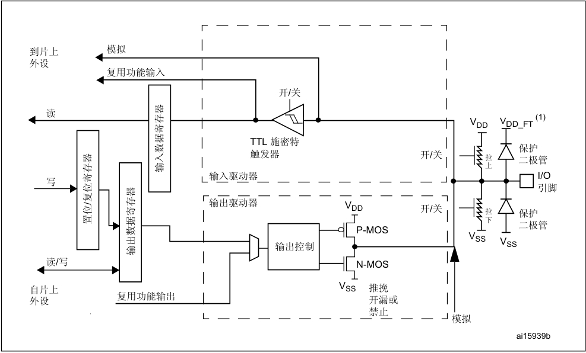

# GPIO/PIN 1bit 数据





从编程关注的寄存器到外部真正的引脚之间的东西如上图。这些电路也是寄存器要配置的东西。对于 STM32 来说，先看配置一个引脚的代码

```c
void gpio_init(void)
{
    GPIO_InitTypeDef gpio_init_config;
    __HAL_RCC_GPIOF_CLK_ENABLE();
	
    gpio_init_config.Pin   = GPIO_PIN_9 | GPIO_PIN_10;
    gpio_init_config.Mode  = GPIO_MODE_OUTPUT_PP;
    gpio_init_config.Pull  = GPIO_PULLUP;
    gpio_init_config.Speed = GPIO_SPEED_HIGH;
    HAL_GPIO_Init(GPIOF, &gpio_init_config);
	
    HAL_GPIO_WritePin(GPIOF,GPIO_PIN_9,GPIO_PIN_SET);
    HAL_GPIO_WritePin(GPIOF,GPIO_PIN_10,GPIO_PIN_SET);
}
```

复用的设置代码

```c

void HAL_UART_MspInit(UART_HandleTypeDef *huart)
{
	GPIO_InitTypeDef gpio_init_config;
	
	if(huart->Instance==USART1)
	{
		__HAL_RCC_GPIOA_CLK_ENABLE();
		__HAL_RCC_USART1_CLK_ENABLE();
	
		gpio_init_config.Mode      = GPIO_MODE_AF_PP;
		gpio_init_config.Pull      = GPIO_PULLUP;
		gpio_init_config.Speed     = GPIO_SPEED_FAST;
		gpio_init_config.Alternate = GPIO_AF7_USART1;

        gpio_init_config.Pin       = GPIO_PIN_9;
		HAL_GPIO_Init(GPIOA,&gpio_init_config);

		gpio_init_config.Pin       = GPIO_PIN_10;
		HAL_GPIO_Init(GPIOA,&gpio_init_config);
	}
}
```

一些关键的点
- 引脚模式的配置：配置为 GPIO 的输入输出或是片内外设的引脚
  - 写 GPIO 端口模式寄存器 (GPIOx_MODER)
- 电气属性配置：推挽、开漏，内部上下拉，速率
  - GPIO 端口输出类型寄存器 (GPIOx_OTYPER)
  - GPIO 端口上拉/下拉寄存器 (GPIOx_PUPDR)
  - GPIO 端口输出速度寄存器 (GPIOx_OSPEEDR)

然后对于普通的 GPIO 来讲，数据的输入输出也是存放在相应的寄存器内的。
- GPIO 端口输入数据寄存器 (GPIOx_IDR)
- GPIO 端口输出数据寄存器 (GPIOx_ODR)
- GPIO 端口置位/复位寄存器 (GPIOx_BSRR)

此外有些 GPIO 也可以做映射，以更加灵活的分配引脚。

一些需要关注的点：什么是推挽输出？什么是开漏输出？分别用在什么场景？

推挽输出驱动能力更强，硬件的话是有两个 MOSFET，一个 N 型，一个 P 型。内部信号直接开关这两 MOSFET，使得 GPIO 可以直接获得电源电平或者 0 电平。

开漏输出的话是只使用下面那个 NPN (N 型 MOSFET) 管，然后 GPIO 只有接地的能力。晶体管如果关断的话，是浮空状态，需要外部上拉。

推挽最常用，输出带负载。开漏的话可以做电平匹配用，或者多设备共用一个信号线如 IIC 的两个线都是开漏输出。


