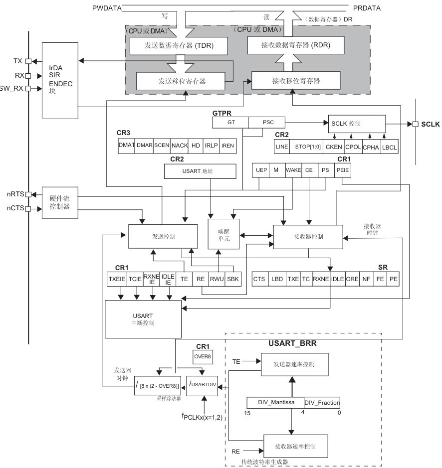

# 通用串口

关于串口通信。

UART 仅使用两条线在设备之间传输数据，UART 的原理很容易理解，是一种**异步串行通信**，这意味着传输双方不共享时钟信号，而是通过一些预定义的协议来确定如何传输数据。UART通过**数据帧**来传输数据，并使用**波特率**来定义数据传输的速率。

几个重要参数
- 波特率：9600，15200
- 起始位：一个 0 开始
- 数据位：5，6，7，8，9。通常用 8
- 奇偶校验位：偶校验：1 为偶数个，可选，不一定要有
- 停止位：1 位或 2 位，电平逻辑为 1


波特率的单位是“比特每秒”，因此它包括数据位、起始位、停止位和校验位在内。因此计算 9600 每秒最多可以收发的字节数

$$
9600 / (1 + 8 + 1 + 2) = 800 Byte
$$

由于 UART 是异步通信协议，它没有发送时钟信号。接收端通过以下方式来同步接收到的信号：
- 起始位检测：当UART接收端检测到数据线的电平由高变低（从高电平进入起始位的低电平），它会开始按照预定的波特率采样数据位。
- 数据采样：接收端通常会在每个数据位的中间进行采样，以尽量避免由于信号干扰导致的错误。
- 停止位：接收端根据停止位的存在确认帧的结束，并准备接收下一个数据帧。

UART 可以支持**全双工**通信，这意味着设备可以同时发送和接收数据，TX 和 RX 线是独立工作的。这与半双工通信不同，半双工通信中只能在一个时刻传输或接收数据。

RS-232、RS-485 等则是定义物理信号的串行通信标准。电气特性、通信距离上。
- RS232：15米，逻辑1 -12V，逻辑 0：+12V
- RS485：1200米，差分信号，

使用通信芯片可以将 UART 信号转换为 232 或 485 通信标准。

STM32 USART 外设。



除了硬件流控，还集成了更高级的功能，所以看起来比较复杂。

这里给出使用 HAL 配置串口外设的程序

```c
void uart_init(u32 bound)
{	
	UART1_Handler.Instance        = USART1;
	UART1_Handler.Init.BaudRate   = bound;
	UART1_Handler.Init.WordLength = UART_WORDLENGTH_8B;
	UART1_Handler.Init.StopBits   = UART_STOPBITS_1;
	UART1_Handler.Init.Parity     = UART_PARITY_NONE;
	UART1_Handler.Init.HwFlowCtl  = UART_HWCONTROL_NONE;
	UART1_Handler.Init.Mode       = UART_MODE_TX_RX;

	HAL_UART_Init(&UART1_Handler);
	HAL_UART_Receive_IT(&UART1_Handler, (u8 *)aRxBuffer, RXBUFFERSIZE);
}
```

通常把 USART 配置为最简单的 UART 模式。具体的底层需要配置的寄存器
- 波特率寄存器 (USART_BRR)
- 控制寄存器 x (USART_CR3)，共 3 个

对于发送和接收，关注
- 数据寄存器 (USART_DR)
- 状态寄存器 (USART_SR)

发送和接收都可以控制查状态寄存器，根据状态寄存器的值做进一步操作。但是通常接收会配合中断使用来提高 CPU 效率。对于大量数据有时还会用 DMA 完成接收。


