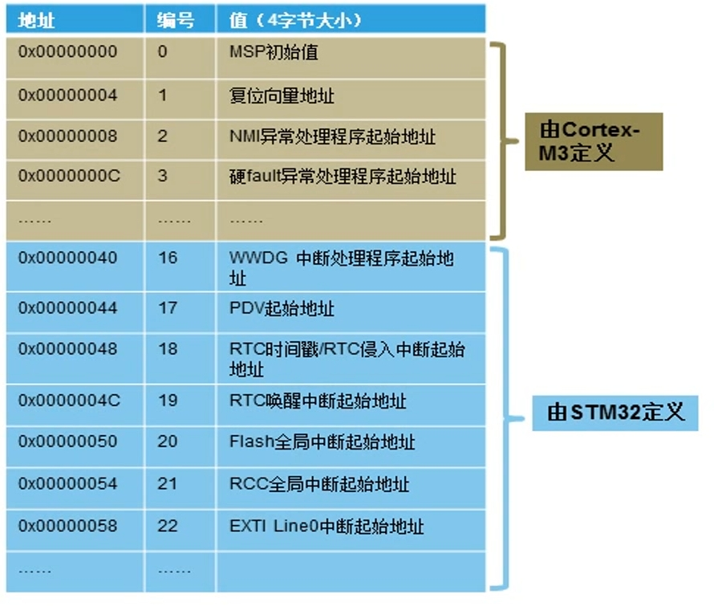
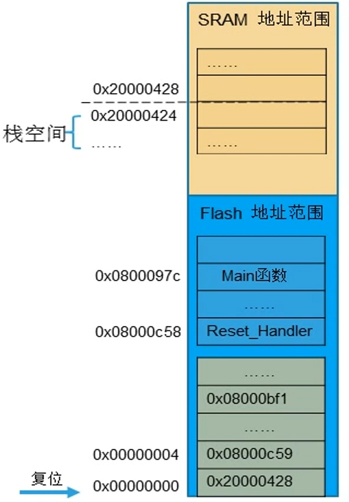
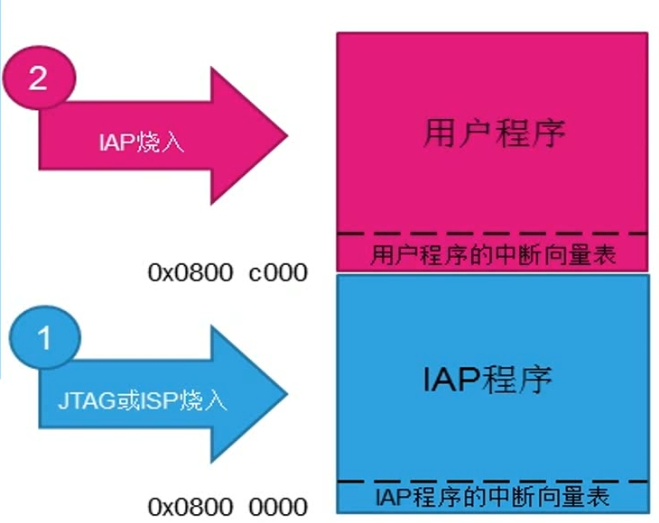

# 中断与中断处理

## 异常类型

### 中断和中断向量表

#0~15 编号中断由 M3 内核定义，剩下的 16~255 由芯片厂家定义。

复位中断、不可屏蔽中断、硬 fault 终端的优先级固定。

中断向量表里存放了中断处理程序的入口地址。默认情况下，CM3 认为向量表位于 0x0 地址处。响应中断时，CM3 会根据中断号从表中找出对应的中断处理程序的入口地址。

对于 STM32 芯片来说，向量表如图

<figure>
  
</figure>

代码中向量表的定义在启动文件中。

CM3 的向量表中的前两个值是 MSP 的初始值和复位向量的地址。CM3 复位时，首先会读这两个值，初始化 MSP 和 PC 寄存器。需要注意的是加载到 PC 的值要为 1，代表这是在 Thumb 状态下执行的。如果值为0 会被认为企图用 ARM 模式执行，这会使处理器发生异常。

初始化举例

<figure>
  
</figure>

复位过程
- 1.设置栈空间
- 2.执行复位函数
- 3.跳转 `main`

map 文件中的地址和 main 实际开始地址不同，这也是表明了处理器执行在 thumb 状态。

### 向量表重定位

默认下，向量表从 0x0 开始，但是这也是可编程的。可以通过修改 NVIC 中的 重定位寄存器实现。复位后该寄存器的值为0，所以在地址 0 处需要有向量表。

向量表只能放在内部 flash 和 ram 区。并且向量表的起始地址是有限制的，偏移值必须必须为 2 的整次幂的值且大于中断向量个数。

向量表重定位的典型使用场景是 IAP 的应用。

<figure>
  
</figure>

```note
IAP(In-Application Programming)

将存储空间分为两个空间，分为存储 IAP 程序和用户程序 ，通过一段代码对另外一段代码编程，而不需要专门的编程接口。这种应用场合需要两个程序
- IAP程序：不涉及产品功能，只通过某种方式接收上位机的数据，来更新第二段程序
- 用户代码：实现功能的代码

IAP 程序放在 flash 的起始位置，上电就执行，用户程序放在后面。用户程序再开始前，要把向量表放在自己的向量表位置。

```

## 异常处理流程


异常处理的基本流程与中断类似，但有一些额外的系统层面处理。以下是异常处理的一般步骤：

- 触发异常：处理器检测到异常条件（例如硬件故障、非法指令执行等）。
- 检查异常优先级：异常根据优先级进行处理，如果当前正在处理一个低优先级的中断，异常可以打断它。
- 保存上下文：在异常处理程序执行之前，处理器会自动保存当前程序的上下文（寄存器、堆栈等）以便在处理完异常后能够正确返回。
- 跳转到异常向量：处理器从异常向量表中找到对应的异常处理程序地址，并跳转到该地址执行异常处理程序。
- 异常处理例程执行：处理器执行异常处理例程（通常是用户定义的代码），以应对错误或采取修复措施。
- 返回主程序：异常处理完毕后，处理器从堆栈恢复之前保存的上下文，继续执行被打断的程序。

## STM32 的 NVIC


## C 语言实现的异常处理

cortex-m 处理器可以把异常处理或中断服务程序实现为普通的 C 程序。


## 中断响应过程


## 咬尾中断机制

## 晚到中断机制


